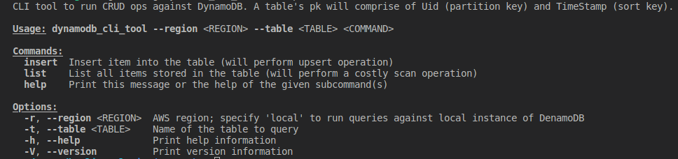

### DYNAMODB CLI TOOL
Run `make db/up` to spin up DynamoDB local and create `People` table (`make db/rm` will clean up).
```
{
    "TableNames": []
}
DinamoDB is up and running at http://127.0.0.1:8000
{
    "TableDescription": {
        "AttributeDefinitions": [
            {
                "AttributeName": "Uid",
                "AttributeType": "S"
            },
            {
                "AttributeName": "TimeStamp",
                "AttributeType": "S"
            }
        ],
        "TableName": "People",
        "KeySchema": [
            {
                "AttributeName": "Uid",
                "KeyType": "HASH"
            },
            {
                "AttributeName": "TimeStamp",
                "KeyType": "RANGE"
            }
        ],
        "TableStatus": "ACTIVE",
        "CreationDateTime": 1670255448.081,
        "ProvisionedThroughput": {
            "LastIncreaseDateTime": 0.0,
            "LastDecreaseDateTime": 0.0,
            "NumberOfDecreasesToday": 0,
            "ReadCapacityUnits": 1,
            "WriteCapacityUnits": 1
        },
        "TableSizeBytes": 0,
        "ItemCount": 0,
        "TableArn": "arn:aws:dynamodb:ddblocal:000000000000:table/People"
    }
}
Successfully created table described in scripts/db/table.json
```
Run `make help` to build the project and see usage options.
 <br>

Instert a few entries:
```
cargo run -- --region "local" --table "People" insert --first-name "Rob" --last-name "Pike"
cargo run -- --region "local" --table "People" insert --first-name "Neil" --last-name "Robertson"
```
List items:
```
cargo run -- --region "local" --table "People" list 
```
The entries auto-assigned uuid and timestamp, so the output will look like:
```
Item { uuid: "e6234f52-654e-4302-955e-44c5e84cd62d", timestamp: "2022-12-05 15:54:11.115921319 UTC", first_name: "Neil", last_name: "Robertson" }
Item { uuid: "029e1db3-0c0c-4abf-a913-87a313364e03", timestamp: "2022-12-05 15:53:18.409671172 UTC", first_name: "Rob", last_name: "Pike" }
```
